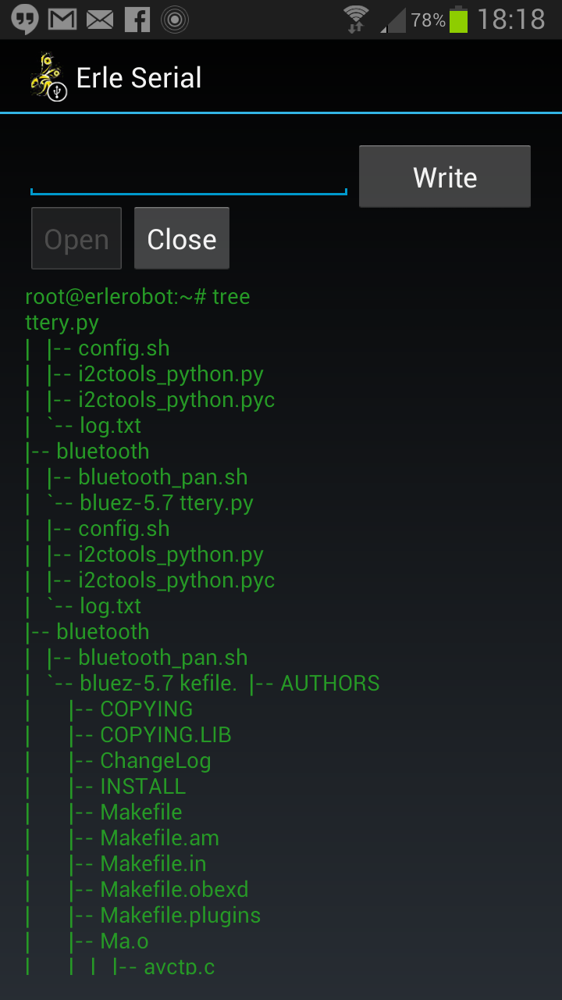
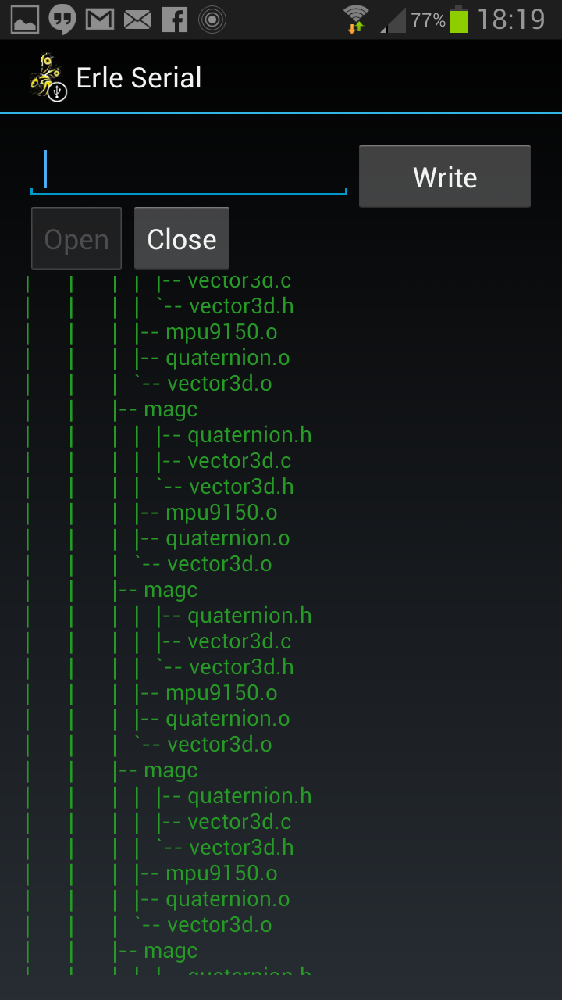
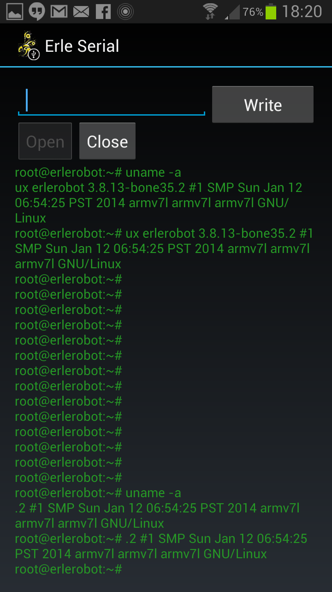

Erle_android_serial app
========================

This app creates a monitor application using the official FTDI Driver D2XX. In a nutshell, it allows to have
direct connection with the robot Erle on your phone. 

